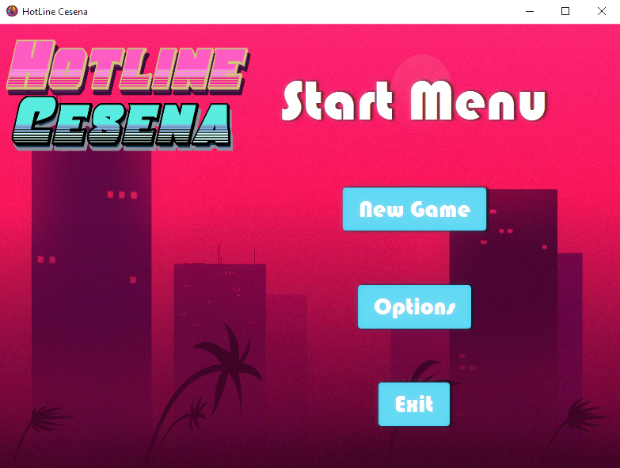
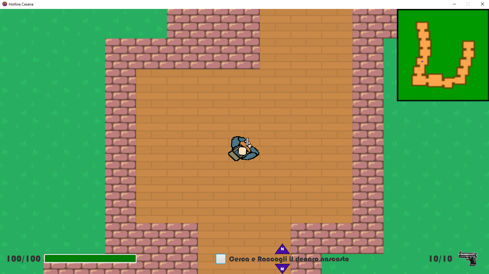
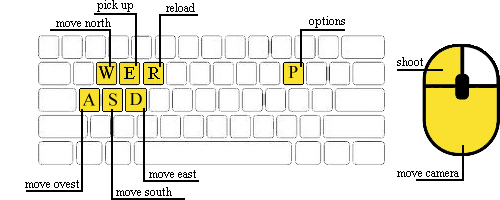

# Hotline Cesena 

Hotline Cesena emula il noto top-down shooter "Hotline Miami", videogioco d'azione in cui il giocatore, equipaggiato con un'arma da fuoco, deve muoversi all'interno di una mappa popolata da svariati nemici e portare a termine determinate missioni. Ogni nuova partita prevede la generazione casuale del layout della mappa e delle entità presenti al suo interno. Il gioco termina al completamento di tutte le missioni o alla morte del giocatore. Inoltre, i punteggi ottenuti alla fine di ogni partita verranno registrati in una classifica generale.

## Esecuzione

```bash
java -jar hotline-cesena.jar
```

## Utilizzo

Al lancio dell'applicazione, superata la schermata iniziale, verrà presentato il Menu principale.



Alla pressione del bottone "New Game", verrà caricata una nuova scena contenente il mondo di gioco (simile a come mostrato di seguito).





## Contributing
[Bryan Corradino](https://github.com/Remisse)  
[Federico Campanozzi](https://github.com/FedericoCampanozzi)  
[Andrea Micheli](https://github.com/Magrad)  
[Andrea Zammarchi](https://github.com/andreazammarchi3)